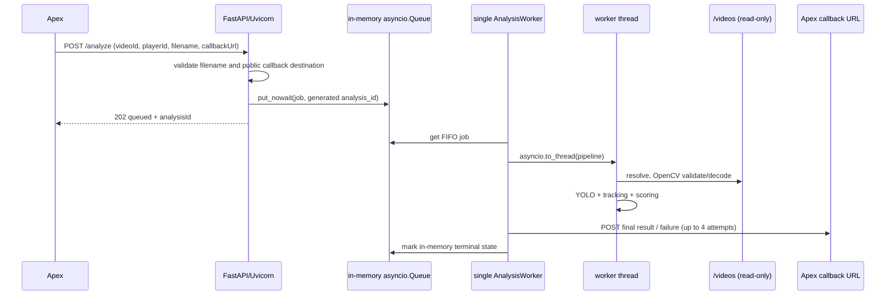

# Super 7 Production Audit

Audit date: 2026-08-12. Scope: repository at `E:\super7`, read-only inspection. No tests, containers, callbacks, migrations, deployments, or production requests were run. Environment-variable values are not reproduced.

## 1. Executive Summary

**Verified:** Super 7 is a FastAPI/Uvicorn modular monolith. `POST /analyze` returns HTTP 202 after putting a lightweight job into a bounded **in-memory** `asyncio.Queue`; one lifespan-owned worker consumes it FIFO. The synchronous OpenCV/YOLO pipeline is offloaded to a thread. The queue, job state, result, retry state, and callback-delivery state are process-local and disappear on restart. The current implementation therefore provides responsiveness and local backpressure, not durable asynchronous processing.

The principal production risks are loss of accepted queued/in-progress work on restart (P0), loss of completed results when callbacks exhaust transient retries (P0), and duplicate analysis/callbacks because no idempotency or persistent uniqueness mechanism exists (P1). A single analysis is intentionally serialized per process. More web workers would create separate queues, admission counters, workers, and model instances; it is not a safe scaling mechanism.

The safest next implementation is to introduce a transactional persistent `analysis_jobs` and callback-outbox data model, then have the API persist a job before acknowledging it. That is the smallest durable boundary; the processor can remain single-concurrency initially.

## 2. Verified Infrastructure Facts

| Fact | Status | Evidence | Notes |
|---|---|---|---|
| Production Compose mounts Apex videos at `/videos` read-only. | Verified | `docker-compose.yml:10-13` | Host source is `/var/www/apex-backend/uploads/videos`.
| Container runs as non-root `app`. | Verified | `Dockerfile:9-20` | Models and video mount are read-only in production Compose.
| Startup uses one Uvicorn process with no `--workers`. | Verified | `Dockerfile:27` | Hence one web worker for this Compose configuration.
| API and Apex share one VPS, stated as 4 vCPU / 15 GiB RAM / 107 GB free / no swap / GPU unconfirmed. | Unknown | Operator-provided premise; no host access performed | Treat as planning assumptions until operator verifies.

## 3. Unknown Information

**Unknown:** actual production image digest/commit; current `.env` values; GPU availability; host/container CPU, RAM, disk, I/O and thread limits; reverse proxy/TLS/firewall; Apex authentication and callback idempotency; Apex retention/deletion behavior; database schema; monitoring/alerting; production traffic/video distribution; and whether the observed VPS currently runs this exact Compose file. No facts above were inferred from secrets or host access.

## 4. Repository and Deployment Map

| Area | Status | Evidence | Description |
|---|---|---|---|
| Composition root | Verified | `src/main.py:38-163` | Builds settings, adapters/services, queue and lifespan worker. |
| Public API | Verified | `src/api/routes.py:82-154` | Sole public analysis route is `POST /analyze`. |
| Queue/worker | Verified | `src/services/analysis_queue.py:52-160` | Bounded in-memory FIFO and exactly one consumer. |
| Pipeline | Verified | `src/api/routes.py:320-470` | Validation, tracking, selection, events and scoring. |
| Deploy | Verified | `.github/workflows/deploy.yml:1-98` | CI-success-on-main SSH deploy, pull/build/up, health polling. |
| CI | Verified | `.github/workflows/ci.yml:1-37` | Format, lint, typecheck, tests and image build. |

## 5. Current Request Lifecycle

1. Apex submits JSON containing `videoId`, `playerId`, safe relative `videoUrl`, and `callbackUrl`; extra fields are forbidden. **Verified** — `src/schemas/analysis.py:10-18`.
2. The route makes a UUID `analysis_id`, validates filename syntax and callback URL, creates a job, and returns 202 only after `put_nowait`; a full queue returns 503. **Verified** — `src/api/routes.py:105-152`.
3. Worker resolves the filename below `VIDEO_STORAGE_ROOT`, opens/validates it, then executes the blocking pipeline in a worker thread. **Verified** — `src/api/routes.py:196-232`; `src/concurrency/executor.py:43-67`.
4. Pipeline validates OpenCV metadata, decodes frames, runs person and ball YOLO inference, ByteTrack, selection, ball/movement/interaction/technical/pass/shot analysis, then physical/technical/player ratings. **Verified** — `src/api/routes.py:342-470`; `src/services/player_tracker.py:91-196`.
5. Result or sanitized failure payload contains `request_id=analysis_id`, `video_id`, and `player_id`; it is POSTed to the supplied callback URL. **Verified** — `src/api/routes.py:157-173,233-266`.
6. The worker marks the in-memory job `COMPLETED` even if a successful-analysis callback is not delivered. **Verified** — `src/api/routes.py:259-266`.



## 6. Current Process and Worker Model

**Verified:** Docker runs `uvicorn main:app --host 0.0.0.0 --port 8000`, with no Gunicorn and no Uvicorn worker count, so the Compose command starts one Uvicorn process (`Dockerfile:27`). Lifespan starts one `AnalysisWorker` (`src/main.py:104-117`), and its docstring/one task confirm one consumer (`src/services/analysis_queue.py:109-160`). `DEFAULT_MAX_ACTIVE_ANALYSES=1` is an additional process-local execution guard (`src/config/analysis.py:5`; `src/main.py:68-77`).

**Verified:** Blocking analysis is not on the event loop: `asyncio.to_thread` executes it (`src/concurrency/executor.py:43-67`). Callback network I/O is also sent through `asyncio.to_thread` (`src/services/callback_service.py:65-69`). The event loop can accept/enqueue requests while the analysis thread runs, but analysis jobs are serialized by the single queue consumer.

**Verified:** The app constructs one player detector and one ball detector per process (`src/main.py:56-61`); each lazily loads and retains its own YOLO instance on first inference (`src/adapters/yolo_player_detector.py:25-60`; `src/adapters/yolo_ball_detector.py:26-66`). More Uvicorn workers would therefore duplicate queues, lifecycle state and model memory, and allow concurrent inference without a shared global capacity limit. Internal OpenCV/PyTorch/Ultralytics thread counts are **Unknown** from repository evidence.

## 7. Current Concurrency Behavior

**Verified:** “Asynchronous” means an HTTP response is returned before in-process background work begins; it does not mean durable queueing. Queue capacity is configurable via `MAX_QUEUED_ANALYSES`; capacity is per process (`src/core/config.py:213-232`; `src/services/analysis_queue.py:52-66`). Queue metrics and state are dictionaries/`asyncio.Queue` only (`src/services/analysis_queue.py:56-59,87-105`).

**Inferred:** Several requests can be accepted concurrently until the local queue fills; only one starts analysis at once. A container/VPS restart can lose accepted waiting jobs, current status, and work in progress because no persistence/recovery code exists. `stop_accepting` explicitly marks waiting jobs cancelled during shutdown (`src/services/analysis_queue.py:90-95`) and worker shutdown cancels its task (`src/services/analysis_queue.py:129-138`). No status endpoint exists; the only health routes are `/health`, `/health/live`, `/health/ready` (`src/api/health.py:26-43`). There is no idempotency key or duplicate request check in the request schema/route.

## 8. Model and Resource Lifecycle

**Verified:** Dependencies include FastAPI, OpenCV headless, Ultralytics (which brings its ML runtime), NumPy through adapters, Uvicorn, and LAP; TensorFlow/FFmpeg CLI are not declared (`pyproject.toml:7-15`). Model device, model paths, and image sizes are environment-configured (`src/core/config.py:217-232`). Each decoded frame is passed individually to person and ball `model.predict`; player `detect_batch` is a loop, not true batching (`src/adapters/yolo_player_detector.py:52-86`).

**Verified:** OpenCV uses `VideoCapture` and reads frame-by-frame, so the full video is not loaded as one frame array (`src/services/player_tracker.py:91-196`). Observations/tracks and later derived event collections can grow with frames; exact peak memory is **Unknown**. Optional debug copy/frame/video output writes below `debug`, bounded per artifact session by `MAX_UPLOAD_BYTES`; debug behavior and retention are environment-configured (`src/api/routes.py:363-369`; `src/diagnostics/artifacts.py:43-111`; `.env.example:15-19`). Two concurrent jobs would contend for CPU, model memory, decoding and disk I/O; the actual degradation is **Unknown** until measured.

## 9. Job Durability Assessment

| Question | Answer | Status/Evidence |
|---|---|---|
| Persistent queue/status/database? | No repository implementation found. | Verified — `analysis_queue.py:52-105`; dependency list `pyproject.toml:7-25`. |
| Survives API/VPS restart? | No. | Inferred from in-memory queue/state and shutdown cancellation. |
| Accepted task can disappear? | Yes, on process loss/shutdown before durable handoff. | Inferred — `analysis_queue.py:90-95,129-138`. |
| Unique job ID? | Generated UUID analysis ID. | Verified — `routes.py:10,114`. |
| Idempotency/duplicate prevention? | None found. | Verified — request contract/submit path `schemas/analysis.py:10-38`; `routes.py:110-129`. |
| Apex query status? | No Super 7 status route. | Verified — `api/health.py:26-43`; `api/routes.py:105-154`. |

## 10. Callback Reliability Assessment

**Verified:** Callback is a JSON POST with result identifiers/body but no auth header, signature, or shared HTTP client (`src/services/callback_service.py:55-89,107-115`). URLs must be HTTP(S), DNS-resolve only to global IPs, and redirects are rejected (`src/services/callback_service.py:30-35,91-104`). It creates a urllib opener per request (`src/services/callback_service.py:107-115`). Timeout comes from `CALLBACK_TIMEOUT_SECONDS`; retry attempts total four with fixed 1/2/4-second delays; non-2xx retry (`src/services/callback_service.py:15,55-89`; `src/core/config.py:217-220`).

**Verified:** retries and delivered state are not persisted. Failed delivery is logged and ignored; completed job state is still returned (`src/api/routes.py:259-266`). Failure results use the same non-durable callback behavior (`src/api/routes.py:236-258`). Callback idempotency at Apex is **Unknown**; duplicate delivery is possible after timeout/ambiguous delivery and duplicate jobs are possible. SSRF controls are meaningful but DNS rebinding/TOCTOU resistance and outbound network policy are **Unknown**.

## 11. Video and Filesystem Safety

**Verified:** only basename-style relative names with `.mp4/.mov/.mkv/.avi` are accepted; absolute paths, separators, `..`, and escaping symlinks are rejected after `resolve(strict=True)` and containment check (`src/services/video_path_resolver.py:15-46,87-102`). The resolver checks file/readability. The validator verifies non-empty file, OpenCV opening and one decoded frame, duration, minimum FPS/resolution (`src/services/video_validator.py:34-68`).

**Verified:** duration is constrained by `MAX_DURATION_SECONDS`. `MAX_UPLOAD_BYTES` is not enforced for shared-volume source files: it is used by artifact quota and public-URL downloader, but `VideoValidator.validate` does not compare local source size to it (`src/core/config.py:217-223`; `video_validator.py:34-68`). Concurrent source modification/deletion can fail analysis; no source snapshot/locking is implemented. `/videos:ro` is sufficient for the ordinary pipeline; debug output is under `/app/debug`, not `/videos` (`main.py:71-75`; `routes.py:363-369`). Disk exhaustion protection is partial: debug artifacts are per-session bounded, while source volume and aggregate debug retention/host free space are unmonitored.

## 12. Security Findings

| Finding | Priority | Status | Evidence |
|---|---|---|---|
| No endpoint authentication/authorization or rate limit exists in this repository. | P1 | Verified | `routes.py:105-154`; dependency/config inspection. |
| Callback has no signature/authentication. | P1 | Verified | `callback_service.py:107-115`. |
| Path traversal and escaping symlink protections exist. | P3 | Verified | `video_path_resolver.py:29-46,87-102`. |
| Callback SSRF mitigation restricts schemes, public DNS IPs and redirects. | P2 | Verified | `callback_service.py:30-35,91-104`. |
| No unsafe shell/subprocess/deserialization found in inspected app path. | P3 | Verified | repository search; route uses structured Pydantic models. |
| Secrets are excluded from the image context; secret-management/host controls are Unknown. | P2 | Verified/Unknown | `.dockerignore`; `.env` was not read. |
| Container is a non-root user; mounts are read-only in production Compose. | P3 | Verified | `Dockerfile:9-20`; `docker-compose.yml:10-13`. |

## 13. CI/CD and Deployment Behavior

**Verified:** CI triggers on push/PR and runs locked install, lint, format, mypy, pytest, image build (`.github/workflows/ci.yml:3-37`). Deploy runs only after successful CI for `main`, serializes deploys, SSHes to `/opt/Super-7`, requires clean `main`, does `git pull --ff-only`, `docker compose build`, `docker compose up -d`, and polls `/health/ready` up to 20 times (`.github/workflows/deploy.yml:3-98`).

**Inferred:** `up -d` after rebuild can replace the container and interrupt jobs; jobs are not durable, and graceful shutdown is cooperative only. The lifecycle asks cancellation checkpoints and awaits active work before worker shutdown (`src/main.py:108-117`; `request_lifecycle.py:129-139`), but native OpenCV/model calls cannot be forcibly interrupted. Docker healthcheck hits only `/openapi.json`, whereas the deploy uses readiness (`Dockerfile:24-25`; Compose `docker-compose.yml:15-23`). Rollback, immutable image tags/digests, migrations, deployed commit observability and production termination grace period are **Unknown**.

## 14. Failure-Mode Analysis

| Scenario | Current behavior / user result | Risk | Automatic recovery | Evidence | Recommended protection |
|---|---|---|---|---|---|
| Simultaneous submissions | 202 until local queue fills, then 503; single FIFO execution. | P1 | No | `routes.py:129-140`; `analysis_queue.py:109-160` | Durable bounded queue + admission metrics. |
| Container/VPS restart, deploy, worker crash, OOM | Queued/in-progress data can vanish; no replay. | P0 | No | `analysis_queue.py:56-59,90-95` | Persistent jobs with leases/recovery. |
| CPU saturation | One job limits pipeline concurrency, but API/Apex share host. | P1 | No | `config/analysis.py:5` | CPU limits, measurement and backpressure. |
| Corrupt/unsupported/missing video | Failure callback attempted; callback failure may hide result. | P1 | No | `video_validator.py:34-68`; `routes.py:236-258` | Durable terminal state/outbox. |
| Duplicate request/callback | No de-duplication; timeout retry can duplicate delivery. | P1 | No | `routes.py:114-129`; `callback_service.py:65-89` | Idempotency key + callback event ID/upsert. |
| Apex unavailable/timeout/4xx/5xx | Four immediate-process attempts, then logged and forgotten. | P0 | No after attempts | `callback_service.py:15,65-89` | Durable outbox/DLQ with retry policy. |
| Redis unavailable | Redis is not currently present. | P3 | N/A | `pyproject.toml:7-25` | If adopted, HA/backup/health design. |
| Disk full | Source/debug writes may fail; no free-space admission check. | P1 | No | `artifacts.py:61-111`; Compose volumes | Disk monitoring/reserve and cleanup policy. |
| Deadline exceeded | Cooperative cancellation at checkpoints; native inference may continue. | P1 | Partial | `request_lifecycle.py:158-170`; `executor.py:43-67` | Worker process per-job timeout/lease. |

## 15. Existing Test Coverage

**Verified, not executed:** unit/integration tests cover queue boundedness/FIFO/failure/shutdown (`tests/test_analysis_queue.py:12-93`), callback success/retry/SSRF (`tests/test_callback_service.py:12-72`), valid API, bad fields, bad callback, queue full and callback lifecycle (`tests/test_analyze.py:73-156`), resolver traversal/symlink safety (`tests/test_video_path_resolver.py:12-53`), and corrupt-video validation (`tests/test_video_validator.py:14-26`). There are concurrency admission/executor/cancellation tests in `tests/concurrency/`.

**Unknown/not covered by identified tests:** durable queue/restart recovery, database state, idempotency, duplicate callback consumer semantics, production callback authentication, OOM, container/VPS restart, external service outage, long real-video resource profile, deployment during work, and multi-process deployment. Tests were deliberately not run to preserve strict audit-only scope and avoid model/service side effects; no pass claim is made.

## 16. Production Measurement Plan

| Required measurement | Collection command for operator (read-only/controlled) |
|---|---|
| CPU/RAM/container limits | `docker stats --no-stream <super7-container>` |
| Host memory/swap/disk | `free -h; df -h; docker system df` |
| GPU | `nvidia-smi` (if installed) |
| Video size/duration/FPS/resolution/codec | `ffprobe -v error -show_entries format=duration,size:stream=codec_name,width,height,r_frame_rate -of json /var/www/apex-backend/uploads/videos/<safe-file>` |
| Queue depth/readiness | `curl --fail http://127.0.0.1:8000/health/ready` and structured logs |
| Analysis and callback latency/status | Add structured timestamp/metric instrumentation first; then sample normal production jobs without payloads. |
| Temp/debug disk | `du -sh /opt/Super-7/debug` and container writable-layer metrics (operator controlled). |

Required fields: video duration, size, resolution/FPS/codec, analysis time, peak container CPU/RAM, disk I/O, temporary disk, callback latency, queue wait, and terminal status. Do not load-test production. Benchmark a representative sanitized corpus in a controlled environment, one job at a time first.

## 17. Architecture Options Comparison

| Option | Durability/retry/idempotency | Complexity/isolation/scale | Suitability now |
|---|---|---|---|
| More Uvicorn/Gunicorn workers | No persistence; duplicates model/queues. | Low complexity, poor global isolation. | No. |
| FastAPI BackgroundTasks | No durability/restart recovery. | Low; same process risk. | No improvement. |
| ThreadPool/ProcessPool | No queue durability unless paired with DB; process pool isolates models. | Medium; CPU/RAM pressure. | Thread pool: no. Process pool: later only behind durable jobs. |
| Celery + Redis | Durable-ish broker, retries/DLQ patterns; idempotency still application-owned. | Medium-high, mature ops. | Viable near term if Redis is operated safely. |
| Dramatiq + Redis | Similar broker durability/retry. | Medium. | Viable alternative; choose only with team familiarity. |
| RQ + Redis | Simpler jobs/retries. | Lower; fewer workflow primitives. | Viable small deployment. |
| Database-backed queue | Transactional job/outbox and idempotency in one DB. | Medium; worker leasing required. | Recommended first choice if Apex DB access/ownership is approved. |
| Kubernetes on single VPS | Does not add capacity/durability by itself. | High operational cost. | No. |
| Dedicated analysis VPS nodes | Durable dispatcher plus isolated workers. | Medium-high, horizontal CPU/GPU scale. | Near-term once measurements require it. |
| Managed queue + autoscaled workers | Strong scaling/observability, managed operations. | High/cloud coupling. | Later when arrivals/cost justify it. |

## 18. Recommended Target Architecture

**Recommendation:** retain a lightweight FastAPI admission API; atomically persist a job and an idempotency record in a production-owned relational database; run a separate worker container at concurrency 1; persist state and results; use a durable callback outbox with a separate delivery loop. A database-backed queue is preferred initially because the business system already needs durable job/result association and an outbox transaction. Celery/Dramatiq/RQ with Redis can be selected instead only after confirming operational ownership, Redis persistence/HA, and the database/outbox boundary.

```mermaid
flowchart LR
 A[Apex] -->|idempotency key + request| API[FastAPI admission]
 API --> DB[(jobs + idempotency + callback outbox)]
 DB --> W[separate analysis worker, concurrency 1]
 W --> V[/videos or object storage]
 W --> DB
 DB --> D[durable callback dispatcher]
 D -->|event ID, signed callback| A
 D -->|exhausted retries| DLQ[dead-letter + alert]
 API --> H[health/ready + job status]
 W --> M[structured logs + metrics]
```

## 19. Job State Machine

`accepted -> queued -> processing -> analysis_completed -> callback_pending -> delivered`

Terminal states: `failed`, `timed_out`, `dead_lettered`, `cancelled`.

API owns `accepted/queued` in the same DB transaction as idempotency; worker owns leased `processing`, analysis completion/failure/time-out; outbox dispatcher owns `callback_pending/delivered/dead_lettered`; an operator/API owns cancellation subject to state/lease rules. State transitions must be conditional, timestamped, durable, and include attempt counts/error codes. At-least-once execution/delivery is acceptable only with idempotent job creation and idempotent callback consumption.

## 20. Concurrency and Capacity Plan

Start with **one API process** and **one analysis-worker process at concurrency 1**. This preserves the verified serialized model use and limits contention on the shared 4-vCPU host assumption. Do not increase API workers to scale analysis.

Measure a representative corpus: concurrency 2 is acceptable only if p95 analysis time and callback latency remain within SLO, Apex p95 latency remains acceptable, no OOM/restarts/decoder or model errors occur, sustained CPU leaves an agreed reserve for Apex, RAM remains below an agreed headroom threshold, and disk I/O/temp-space stays below safety thresholds. Stop immediately on CPU saturation, swap activity, memory pressure/OOM, error growth, excessive queue wait, or Apex interference.

For arrival rate `lambda` jobs/time, average analysis duration `S`, and `c` workers, utilization is `rho = lambda*S/c`; keep `rho` materially below 1 to meet a target queue wait `Wq`. A practical planning inequality is `lambda <= c/(S + target_Wq)` only as a conservative screening approximation; measure the real queue distribution. A queue prevents loss and creates backpressure; it does not make finite CPU finish all jobs at once.

## 21. Phased Implementation Roadmap

| Phase | Goal / exact changes | Dependencies & risks | Verify / rollback / done |
|---|---|---|---|
| 0 Measurement | Add redacted structured job/queue/callback metrics and controlled benchmark corpus. | Operator access; avoid PII/secrets. | Baseline one worker; revert instrumentation commit; done when baseline fields are captured. |
| 1 Reliability | DB jobs/idempotency/outbox, worker lease/retry, status route, callback event ID/signing, graceful drain. | DB ownership/schema/migration approval; migration risk. | Kill/restart controlled worker tests; rollback app while preserving schema/jobs; done when no accepted job is untracked. |
| 2 Controlled concurrency | Isolated worker processes, fixed resource limits; test 1 then 2. | Model memory/thread safety, Apex co-tenancy. | Acceptance criteria in §20; revert concurrency to 1; done when sustained controlled results pass. |
| 3 Scaling | Dedicated worker VPS/GPU nodes or managed workers. | Network/storage/security/cost. | Drain then route a canary; rollback dispatcher routing; done when capacity/SLO requires it. |
| 4 Kubernetes decision | Adopt only for multi-node scheduling, rollout, autoscaling and operational need. | Platform expertise/monitoring. | Staged migration and rollback plan; done only when objective multi-node thresholds are met. |

## 22. Prioritized Findings

1. **P0 — accepted queued jobs are process-memory only and may be lost on restart.** Verified: `src/services/analysis_queue.py:52-105,129-160`.
2. **P0 — callback delivery failure after four attempts is logged then discarded, despite analysis success.** Verified: `src/services/callback_service.py:15,55-89`; `src/api/routes.py:259-266`.
3. **P1 — no idempotency key or durable duplicate prevention.** Verified: `src/schemas/analysis.py:10-38`; `src/api/routes.py:110-129`.
4. **P1 — no API or callback authentication is implemented in this repository.** Verified: `src/api/routes.py:105-154`; `src/services/callback_service.py:107-115`.
5. **P1 — deployment can interrupt jobs and cooperative cancellation cannot forcibly stop native inference.** Verified/Inferred: `.github/workflows/deploy.yml:78-82`; `src/concurrency/executor.py:43-67`.

## 23. Exact Next Step

Approve a design-only schema/contract for transactional durable job creation and callback outbox before changing concurrency. Likely implementation files: `src/api/routes.py`, `src/services/analysis_queue.py` (replacement/adapter), new persistence/outbox modules, `src/main.py`, `src/api/health.py`, schemas/tests, `docker-compose.yml`, dependency/lock files, and deployment documentation. Operator questions: which database Super 7 may use; Apex callback idempotency contract; desired retention/SLO; production resource baseline; whether a dedicated worker host is permitted; and API/callback authentication mechanism.

## 24. Evidence Index

Primary evidence inspected: `src/main.py:38-163`; `src/api/routes.py:105-266,320-470`; `src/services/analysis_queue.py:1-160`; `src/api/request_lifecycle.py:56-178`; `src/concurrency/executor.py:43-67`; `src/concurrency/admission.py:38-86`; `src/services/callback_service.py:15-115`; `src/services/video_path_resolver.py:15-102`; `src/services/video_validator.py:27-68`; `src/services/player_tracker.py:91-196`; YOLO adapters; artifact manager; Docker/Compose; GitHub workflows; dependency/config/example files; and listed tests.

No project or deployment files were modified other than this `SUPER7_PRODUCTION_AUDIT.md`. Kubernetes was evaluated as a conditional future platform, not recommended for a single VPS. Unknown facts are explicitly labelled rather than assumed. No secrets, values, passwords, tokens, or private URLs are included.
