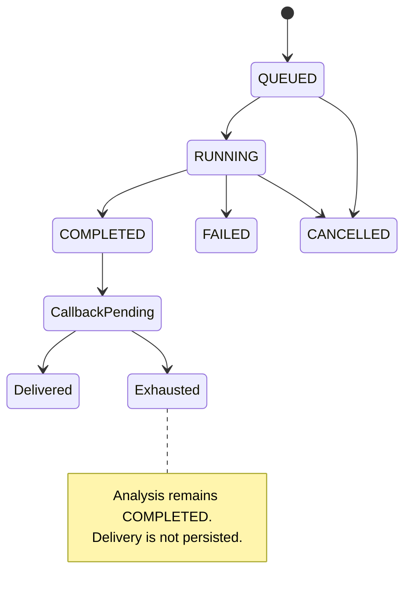
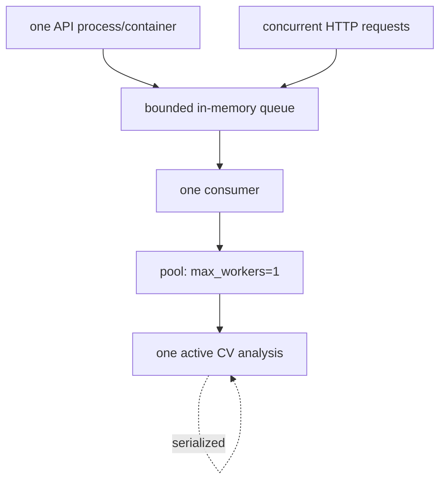

# System and runtime

## Implemented architecture

The composition root is [`src/main.py`](../../src/main.py). It starts validation of the shared video root, the parent-owned process pool, and one queue worker during FastAPI lifespan. `src/api` owns HTTP admission, health and public mapping; `src/services` owns queueing, callback, path resolution, CV/scoring and child composition; `src/adapters` owns YOLO adapters; `src/domain` contains value models; `src/diagnostics` owns artifacts/performance/job events; `src/config` and `src/core` own settings/logging; `src/schemas` owns public contracts. Tests cover unit, API, integration, lifecycle and process boundaries.

`POST /analyze` validates only a safe filename reference and a public callback URL, creates a UUID `analysisId`, enqueues lightweight data, and replies HTTP 202. Missing/unreadable video is resolved later in the child. The bounded FIFO `asyncio.Queue` rejects when full or closing (503); its state map is process-local. One `AnalysisWorker` marks queued/running/terminal states and serializes all processing.

`ProcessAnalysisPool` is a one-worker `ProcessPoolExecutor` created with the `spawn` context. Its top-level initializer builds a child-local settings snapshot, detector/tracker/pipeline components, `VideoPathResolver`, and `ArtifactManager`; models are lazy rather than loaded in the initializer. Only a pickle-safe request (safe IDs and filename) and serialized result envelope cross the boundary; the parent validates schema and analysis ID before using it. The child invokes the existing analysis pipeline; the parent constructs and sends callback payloads. Parent-owned `CallbackService` performs four total attempts with 1/2/4-second delays for transport, timeout, and non-2xx failures. Callback retries occupy the sole worker slot. Cancellation produces no callback; failure callbacks use a fixed sanitized public message.

Artifacts are request-scoped directories under `DEBUG_OUTPUT_DIR`, with safe names, quotas, staged publication and configured retention; cleanup is non-throwing so it cannot mask analysis failure. Video resolution confines the filename to `VIDEO_STORAGE_ROOT` and checks root, containment, regular file and read access. Logs record lifecycle timings and sanitized IDs/error classes; they deliberately omit callback URLs, paths, payloads and secrets. There is no metrics backend, trace system, durable audit store, or per-job query endpoint.

Health routes are [`/health/live`, `/health/ready`, `/health`](../../src/api/health.py). Readiness checks lifecycle, queue/worker, artifacts, storage root and application state; it may return 503 at capacity/shutdown. Shutdown stops admission, cancels queued in-memory work, cancels the parent waiting task, then waits for pool shutdown. It cannot forcibly terminate running native child inference; a running child may finish before shutdown returns.

Configuration is the immutable [`Settings`](../../src/core/config.py): environment-backed operational values include video root, model paths/device/thresholds, queue capacity, callback timeout, request/video limits and debug retention. Many football thresholds are static product configuration. Docker uses one Compose service, exposes `0.0.0.0:8000`, mounts `/models` and Apex video storage read-only, and healthchecks `/openapi.json` ([`Dockerfile`](../../Dockerfile), [`docker-compose.yml`](../../docker-compose.yml)). CI runs lint, format, mypy, tests and image build; deploy is main-only and guard-protected ([workflows](../../.github/workflows/)).

Current limitations: no database/broker/outbox, no restart recovery, no atomic idempotency, no hard task kill, no multi-instance coordination, no callback delivery persistence or authentication/signature, and no parallel video execution.

## Shutdown grace update (2026-08-31)

`AnalysisWorker` now owns a bounded five-second active-analysis shutdown grace supplied by internal `Settings`. Shutdown still closes admission and cancels queued in-memory jobs; it waits only for the one active processor to return and records its actual `COMPLETED` or `FAILED` result. At grace expiry it cancels the remaining active worker task, preserving `CANCELLED` behavior. Idle workers stop promptly and the consumer does not start another queued job after shutdown begins. This does not make `RequestLifecycle.shutdown()` or process-pool shutdown bounded, add durability, change callback semantics, or alter the one-worker architecture. Before deployment, the container/process supervisor must allow more than five seconds before forceful termination.
