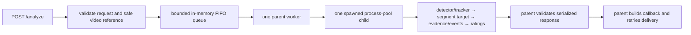

> Status: Discovery evidence — not an approved implementation contract.
>
> This document describes the repository state inspected at the recorded Git
> commit. Proposed Sprint 1 behavior remains subject to review and approval.

# Current implemented behavior

| Component | Current behavior | Evidence | Classification | Sprint 1 impact |
|---|---|---|---|---|
| Request/admission | `AnalyzeRequest` accepts `videoId`, `playerId`, `videoUrl`, `callbackUrl`; extras forbidden. `create_router()` returns queued 202 via `AnalyzeQueuedResponse`. | `src/schemas/analysis.py:AnalyzeRequest`, `AnalyzeQueuedResponse`; `src/api/routes.py:create_router`; `tests/test_analyze.py` | Implemented and production-wired | Player identity enters here but has no visual binding. |
| Queue/worker | Lifespan starts bounded `asyncio.Queue` and one `AnalysisWorker`; state is process-local and non-durable. | `src/main.py:create_app`; `src/services/analysis_queue.py:AnalysisQueue,AnalysisWorker`; `tests/test_analysis_queue.py`, `tests/api/test_process_analysis_job_processor.py` | Implemented and production-wired | No change proposed. |
| Child boundary | Spawned one-worker process pool owns CV composition; parent validates serializable child result. | `src/services/process_analysis_pool.py:ProcessAnalysisPool`; `src/services/process_entrypoint.py:run_child_analysis`; `tests/services/test_process_analysis_pool.py`, `test_process_entrypoint.py` | Implemented and production-wired | Target/rating gate must cross this boundary deliberately. |
| Video/CV | Child validates/resolves video and composes YOLO person/ball detection, ByteTrack, ball tracking and downstream pipeline. | `src/services/analysis_composition.py:create_analysis_components`; `src/services/player_tracker.py:DetectionOnlyPlayerTracker.analyze`; `src/api/routes.py:_analyze_uploaded`; composition/tracker tests | Implemented and production-wired | Current tracking identity is analysis-local. |
| Target selection | Segment mode builds qualifying visual track segments and chooses highest segment quality. | `src/services/segment_selection.py:build_segments,rank_segments,select_segment`; `src/api/routes.py:_analyze_uploaded`; `tests/test_segment_selection.py`, `tests/test_selection.py` | Implemented and production-wired | It chooses analyzability, not requested-player identity. |
| Evidence/rating | Physical, technical, interactions, detailed ratings and V2 public rating mapping are computed after a selected track. | `src/services/scoring/*`; `src/services/player_rating/engine.py:PlayerRatingEngine.summarize`; `src/api/public_rating_mapper.py:public_rating_v2`; rating tests | Implemented and production-wired | No gate connects target identity to rating availability. |
| Overall | Available technical/physical/ball categories are weighted and renormalized; at least two required. | `src/services/player_rating/engine.py:PlayerRatingEngine._overall`; `tests/test_player_rating_engine.py`; ADR-002 | Implemented and production-wired | Can produce a number for an unverified visual target. |
| Callback | Parent owns payload construction and four-attempt callback delivery; delivery failure does not rewrite completed analysis. | `src/api/routes.py:_callback_payload,create_process_analysis_job_processor`; `src/services/callback_service.py:CallbackService`; `tests/test_callback_service.py`, `tests/api/test_process_analysis_job_processor.py` | Implemented and production-wired | Any public representation requires Apex compatibility review. |

The callback result is distinct from analysis state: analysis may be completed while callback
delivery exhausts retries. Failed analysis has a sanitized failed callback; cancellation has no
callback. `null` rating means unavailable/unsupported or insufficient evidence, not failed
analysis or zero (ADR-003). Current diagnostics include candidate/track/evidence quantities, but
not proof that the selected visual person is the Apex player.

`target_selection_status` (`ESTABLISHED`/`NOT_ESTABLISHED`) and
`identity_continuity_status` (`MAINTAINED`/`UNCERTAIN`/`LOST`/`NOT_EVALUATED`) are proposed future
states, not current runtime fields. Initial establishment must not be conflated with subsequent
identity maintenance or with real-world identity verification.

Configuration affecting selection is owned by `Settings`: selection mode, gap, visible-frame,
duration, mean-detection-confidence, quality and normalized-centre-jump thresholds. Production
wiring uses the application composition above; Docker/CI/deploy wiring is documented in the
handoff and workflows. No live production behavior was exercised in this discovery.
